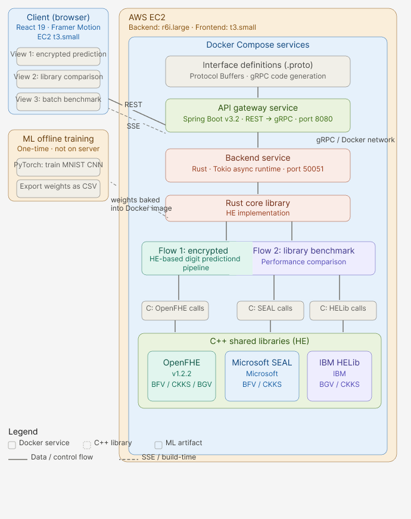

# Encrypted Machine Learning Benchmark Framework

> **An end-to-end empirical study of privacy-preserving neural network inference using Fully Homomorphic Encryption — quantifying the real latency, noise, and accuracy trade-offs of computing on encrypted data.**

[](https://github.com/TiffanyYongNgikChee/Encrypted-Machine-Learning-Benchmark-Framework/actions)
[](https://www.rust-lang.org/)
[](https://www.openfhe.org/)
[](https://spring.io/projects/spring-boot)
[](https://react.dev/)
[](https://www.docker.com/)
[](LICENSE)
[](https://hexplore-neon.vercel.app)

---

## Abstract

Homomorphic Encryption (HE) enables computation directly on encrypted data without ever decrypting it — a property with transformative implications for privacy-preserving machine learning. However, the practical cost of this property has been poorly characterised in the context of real neural network inference.

This project implements a full-stack FHE inference pipeline: a LeNet-5 convolutional neural network trained with polynomial activations is deployed as a service that classifies handwritten digits **entirely on ciphertext** using the BFV scheme. A live interactive dashboard and a batch benchmarking suite measure how key HE parameters — security level, polynomial activation degree, and quantisation scale factor — affect latency, classification accuracy, and noise budget consumption.

**Core finding:** Encrypted CNN inference on a single 28×28 MNIST image takes ~5–8 seconds on AWS EC2 (r6i.large, 16 GB RAM) at 128-bit security with degree-2 polynomial activations, delivering **identical accuracy** (88.86%) to the plaintext model — a ~2,000× overhead that represents the measurable cost of computing on data you can never see.

---

## Key Results

> ⚠️ *Benchmark results will be added here once the full experiment run is complete.*

---

## System Architecture



**Deployment:**
- Frontend → [Vercel](https://hexplore-neon.vercel.app) (CDN, always online)
- Backend → AWS EC2 `r6i.large` (Docker Compose, online during demos)
- Vercel proxies `/api/*` to EC2 server-side, eliminating browser mixed-content restrictions

---

## CNN Pipeline on Encrypted Data

> 📸 *Screenshot of the live frontend pipeline visualisation will be added here.*

**Why x² instead of ReLU?** ReLU requires a comparison to zero — a non-polynomial operation that cannot be evaluated homomorphically without a prohibitively expensive polynomial approximation. The degree-2 polynomial x² is evaluable with a single ciphertext multiplication and is sufficient to introduce the non-linearity required for multi-layer classification (Fan & Vercauteren, 2012; Cheon et al., 2018).

---

## Repository Structure

```
Encrypted-Machine-Learning-Benchmark-Framework/
│
├── proto/                              # Protocol Buffer schema (source of truth)
│   └── he_service.proto                #   All gRPC service + message definitions
│
├── src/                                # Rust core library (HE bindings + inference engine)
│   ├── lib.rs                          #   Crate root; feature flags
│   ├── open_fhe_binding.rs             #   Raw extern "C" FFI declarations for OpenFHE
│   ├── open_fhe_lib.rs                 #   Safe Rust wrappers (OpenFHEContext, Ciphertext, etc.)
│   ├── encrypted_inference.rs          #   Full HE-CNN pipeline (encrypt → forward → decrypt)
│   ├── weight_loader.rs                #   Load quantised CSV weights into BFV plaintexts
│   ├── helib_bindings.rs               #   Raw extern "C" FFI declarations for HElib
│   └── helib.rs                        #   Safe Rust wrappers for HElib
│
├── grpc_server/                        # Rust gRPC server (Tonic framework)
│   ├── Cargo.toml
│   └── src/
│       └── main.rs                     #   HEService RPC implementations; listens on :50051
│
├── openfhe_cpp_wrapper/                # C++ layer — OpenFHE (primary inference library)
│   ├── CMakeLists.txt
│   ├── include/
│   │   ├── openfhe_wrapper.h           #   BFV context, key generation, encrypt/decrypt API
│   │   └── openfhe_cnn_ops.h           #   conv2d, avgpool, matmul, polynomial activation
│   └── src/
│       ├── openfhe_wrapper.cpp
│       └── openfhe_cnn_ops.cpp
│
├── cpp_wrapper/                        # C++ layer — Microsoft SEAL (micro-benchmarks)
│   ├── CMakeLists.txt
│   ├── include/seal_wrapper.h
│   └── src/
│
├── helib_wrapper/                      # C++ layer — IBM HElib (micro-benchmarks)
│   ├── CMakeLists.txt
│   ├── include/
│   └── src/
│
├── spring-boot-api/                    # Java REST gateway (Spring Boot 3.2)
│   ├── Dockerfile
│   ├── pom.xml
│   └── src/main/java/com/fyp/hebench/
│       ├── HeBenchApplication.java     #   Application entry point
│       ├── controller/
│       │   └── BenchmarkController.java #  REST endpoints + SSE streaming
│       ├── service/
│       │   └── GrpcClientService.java  #   gRPC stub, protobuf marshalling
│       └── model/                      #   Request/Response POJOs
│
├── frontend/                           # React 19 interactive dashboard
│   ├── Dockerfile                      #   Nginx-served production build
│   ├── nginx.conf                      #   /api/* proxy to Spring Boot
│   ├── vercel.json                     #   Vercel rewrite rules (SPA + API proxy)
│   ├── public/
│   │   └── benchmark_data.json         #   Pre-computed batch benchmark results
│   └── src/
│       ├── api/
│       │   └── client.js               #   REST + SSE fetch wrappers
│       └── workbench/
│           ├── Workbench.js            #   Main page (canvas, pipeline, results)
│           ├── MiniCanvas.js           #   28×28 drawing canvas
│           ├── CnnPipeline.js          #   Animated layer-by-layer diagram
│           ├── LiveStatusFeed.js       #   Real-time SSE log display
│           ├── OutputPanel.js          #   Prediction result + confidence bar
│           ├── MetricsStrip.js         #   Per-layer timing breakdown
│           ├── LibraryComparison.js    #   SEAL vs HElib vs OpenFHE benchmarks
│           ├── MnistBatchBenchmark.js  #   100-image batch result table
│           ├── NeuralHero.js           #   Animated hero section
│           ├── CnnClassroom.js         #   Guided tutorial explainer
│           └── useInferenceProgress.js #   SSE stream state hook
│
├── mnist_training/                     # PyTorch training pipeline
│   ├── train_mnist.py                  #   Train HE_CNN (degree 2 / 3 / 4 activations)
│   ├── verify_plaintext_cnn.py         #   Validate weights reproduce expected accuracy
│   ├── export_test_images.py           #   Export MNIST test images as JSON pixel arrays
│   ├── find_safe_params.py             #   Search for plaintext moduli that avoid overflow
│   ├── check_overflow.py               #   Simulate BFV overflow given scale + modulus
│   ├── requirements.txt
│   ├── weights/                        #   Default weights (symbolic link → weights_deg2/)
│   ├── weights_deg2/                   #   Quantised CSV weights for x² activation
│   ├── weights_deg3/                   #   Quantised CSV weights for cubic activation
│   └── weights_deg4/                   #   Quantised CSV weights for quartic activation
│
├── scripts/
│   ├── run_all_benchmarks.sh           #   Run complete benchmark suite end-to-end
│   ├── csv_to_json.py                  #   Convert raw CSV results → frontend JSON
│   └── setup_new_experiments.sh        #   Provision EC2 and start Docker Compose
│
├── docs/
│   ├── grpc-api.md                     #   Full gRPC API reference
│   └── project-overview.md             #   Architecture decision record
│
├── examples/                           #   Standalone Rust example binaries
│   ├── benchmark.rs
│   ├── mnist_inference.rs
│   └── mnist_benchmark.rs
│
├── Dockerfile                          #   Multi-stage: compile SEAL+HElib+OpenFHE → slim runtime
├── docker-compose.yml                  #   Default: he-grpc-server + spring-boot-api
├── docker-compose.frontend.yml         #   EC2 variant: frontend Nginx + spring-boot-api
├── docker-compose.compute.yml          #   EC2 variant: Rust gRPC server only
├── Cargo.toml                          #   Workspace manifest
└── build.rs                            #   Rust build script (links C++ .so files)
```

---

## Quick Start

### Prerequisites

| Tool | Version | Notes |
|---|---|---|
| [Docker](https://docs.docker.com/get-docker/) | 24+ | Required for all-in-one setup |
| [Docker Compose](https://docs.docker.com/compose/) | 2.x | Bundled with Docker Desktop |
| Rust | 1.75+ | Only for local development |
| Java | 17+ | Only for local development |
| Node.js | 20+ | Only for frontend development |
| Python | 3.10+ | Only for model training |

> **Note:** First Docker build compiles OpenFHE, SEAL, and HElib from source. This takes **10–20 minutes** and requires ≥8 GB RAM available to Docker. Subsequent builds use cache.

---

### 1. Clone and Build

```bash
git clone https://github.com/TiffanyYongNgikChee/Encrypted-Machine-Learning-Benchmark-Framework.git
cd Encrypted-Machine-Learning-Benchmark-Framework

# Build all services (takes 10–20 min on first run)
docker compose build
```

### 2. Start the Backend

```bash
# Start the Rust gRPC server and Spring Boot REST API
docker compose up -d he-grpc-server spring-boot-api

# Confirm the API is healthy
curl http://localhost:8080/api/health
# Expected: OK
```

### 3. Start the Frontend

```bash
cd frontend
npm install
npm start
# Opens http://localhost:3000
```

Or to run the full stack (frontend served by Nginx on port 80):

```bash
docker compose -f docker-compose.frontend.yml up -d
# Opens http://localhost
```

---

## Usage Guide

### Interactive Inference (Browser)

1. Navigate to [http://localhost:3000](http://localhost:3000) (or the [live demo](https://hexplore-neon.vercel.app))
2. Draw a digit (0–9) on the canvas in the **Workbench** panel
3. Click **RUN ▶** — the server encrypts your pixels, runs the 12-layer CNN on ciphertext, and streams per-layer timing back in real time
4. The **Output** panel shows the predicted digit, confidence score, and decrypted logits
5. Use the **Library Comparison** section to benchmark SEAL vs HElib vs OpenFHE on identical operations
6. The **MNIST Batch Benchmark** section shows pre-computed results for 100 real test images

### REST API

**Predict a digit (single image)**

```bash
# Generate 784 zeros as a placeholder; substitute real pixel values
PIXELS=$(python3 -c "print(','.join(['0']*784))")

curl -s -X POST http://localhost:8080/api/predict \
  -H "Content-Type: application/json" \
  -d "{\"pixels\":[$PIXELS],\"scaleFactor\":1000,\"securityLevel\":0,\"activationDegree\":2}" \
  | python3 -m json.tool
```

**Response:**
```json
{
  "predictedDigit": 0,
  "confidence": 0.91,
  "logits": [842, -31, 12, -5, 19, -22, 5, 3, -8, 102],
  "encryptionMs": 118.4,
  "conv1Ms": 812.3,
  "bias1Ms": 4.1,
  "act1Ms": 405.1,
  "pool1Ms": 198.2,
  "conv2Ms": 304.6,
  "bias2Ms": 3.0,
  "act2Ms": 102.4,
  "pool2Ms": 51.3,
  "fcMs": 78.9,
  "biasFcMs": 1.8,
  "decryptionMs": 28.7,
  "totalMs": 5832.7,
  "floatModelAccuracy": 88.86,
  "securityLevelLabel": "128-bit",
  "activationDegree": 2,
  "status": "success"
}
```

**Stream layer-by-layer progress (Server-Sent Events)**

```bash
curl -N -s -X POST http://localhost:8080/api/predict/stream \
  -H "Content-Type: application/json" \
  -d "{\"pixels\":[$PIXELS],\"scaleFactor\":1000,\"securityLevel\":0}"
```

Each event fires as a layer completes:
```
data: {"eventType":"layer_done","layer":"encrypt","layerMs":118.4,"elapsedMs":118.4}
data: {"eventType":"layer_done","layer":"conv1","layerMs":812.3,"elapsedMs":930.7}
data: {"eventType":"layer_done","layer":"act1","layerMs":405.1,"elapsedMs":1335.8}
...
data: {"eventType":"complete","result":{"predictedDigit":0,"totalMs":5832.7,...}}
```

**Run a library benchmark**

```bash
# Benchmark OpenFHE on 10 operations (add, multiply, keygen)
curl -s -X POST http://localhost:8080/api/benchmark/run \
  -H "Content-Type: application/json" \
  -d '{"library":"OpenFHE","numOperations":10}' | python3 -m json.tool

# Compare all three libraries simultaneously
curl -s -X POST http://localhost:8080/api/benchmark/compare \
  -H "Content-Type: application/json" \
  -d '{"numOperations":10}' | python3 -m json.tool
```

### gRPC API (Direct)

Defined in [`proto/he_service.proto`](proto/he_service.proto). Full reference: [`docs/grpc-api.md`](docs/grpc-api.md).

| RPC | Streaming | Description |
|---|---|---|
| `PredictDigit` | Unary | Encrypted CNN inference, returns full result |
| `PredictDigitStream` | Server-streaming | Same, but streams per-layer progress events |
| `RunBenchmark` | Unary | Single-library micro-benchmark |
| `RunComparisonBenchmark` | Unary | All three libraries, parallel |
| `Encrypt` / `Decrypt` | Unary | Low-level encrypt/decrypt a vector |
| `Add` / `Multiply` | Unary | Homomorphic addition / multiplication |

### Train Your Own Model

```bash
cd mnist_training
python3 -m venv .venv && source .venv/bin/activate
pip install -r requirements.txt

# Train degree-2 model (recommended — ~10 min on CPU, ~2 min on GPU)
python train_mnist.py --degree 2

# Trains degree-3 and degree-4 variants as well
# Exports quantised integer weights to weights_deg{2,3,4}/*.csv
```

Then regenerate the batch benchmark JSON:

```bash
python scripts/csv_to_json.py
# Writes: frontend/public/benchmark_data.json
```

---

## Parameter Reference

These parameters control the fundamental accuracy/security/performance trade-off in BFV-based FHE:

| Parameter | What it controls | Values tested | Finding |
|---|---|---|---|
| **Security level** | Ring dimension n; hardness of Ring-LWE problem | 128-bit (n=4096), 192-bit (n=8192), 256-bit (n=16384) | Only 128-bit is feasible on 16 GB RAM. Higher levels OOM during key generation. |
| **Activation degree** | Polynomial approximation of non-linearity | x² (deg 2), x³ (deg 3), x⁴ (deg 4) | x² is the only validated option. Higher degrees overflow the plaintext modulus at inference time. |
| **Scale factor S** | Integer quantisation of floating-point weights: `round(w × S)` | 100, 1,000, 10,000 | S=1000 is the sweet spot — S=100 loses too much weight precision; S=10,000 causes intermediate overflow. |
| **Plaintext modulus p** | Ceiling for all intermediate integer arithmetic | Primes near 10⁸ satisfying p ≡ 1 (mod 2n) | p=100,073,473 provides sufficient headroom for the entire pipeline at S=1,000. |
| **Multiplication depth** | Maximum sequential ciphertext multiplications before noise overwhelms signal | 6 (fixed for this CNN) | Conv1×Act1×Conv2×Act2×FC×spare = depth 6. Determines minimum viable n. |

---

## Tech Stack

| Layer | Technology | Version | Rationale |
|---|---|---|---|
| **HE (primary)** | [OpenFHE](https://www.openfhe.org/) | 1.2.2 | Actively maintained, BFV + CKKS + TFHE, clean C++ API, NIST-standard parameters |
| **HE (benchmarks)** | [Microsoft SEAL](https://github.com/microsoft/SEAL) | 4.1.1 | Industry-standard BFV/CKKS; reference implementation |
| **HE (benchmarks)** | [IBM HElib](https://github.com/homenc/HElib) | 2.3.0 | BGV scheme; bootstrapping support; academic origin |
| **Core runtime** | [Rust](https://www.rust-lang.org/) + [Tonic](https://github.com/hyperium/tonic) | 1.75 / 0.11 | Memory-safe FFI across C++ boundary; zero-cost abstractions; async gRPC |
| **FFI bridge** | C++ `extern "C"` wrappers | C++17 | Only viable way to call OpenFHE/SEAL/HElib from Rust |
| **API gateway** | [Spring Boot](https://spring.io/projects/spring-boot) + [gRPC-Java](https://grpc.io/) | 3.2 / 1.60 | REST + SSE for browser clients; automatic protobuf stub generation |
| **Serialisation** | [Protocol Buffers](https://protobuf.dev/) | 3.25 | Typed cross-language schema; streaming support |
| **Frontend** | [React](https://react.dev/) + [Framer Motion](https://www.framer.com/motion/) | 19 / 12 | Live SSE visualisation; drawing canvas; animated pipeline |
| **ML training** | [PyTorch](https://pytorch.org/) | 2.x | Train HE-compatible CNN; export integer weights as CSV |
| **Container** | [Docker](https://www.docker.com/) multi-stage + Compose | 24+ | Reproducible build compiling all three HE libraries from source |
| **Deployment** | AWS EC2 + [Vercel](https://vercel.com/) | — | EC2 for compute; Vercel for always-on frontend CDN |

---

## Development

### Build C++ Wrappers Locally

> These steps assume OpenFHE, SEAL, and HElib are installed. Use Docker if they are not.

```bash
# OpenFHE wrapper
cd openfhe_cpp_wrapper
mkdir -p build && cd build
cmake .. -DOpenFHE_DIR=/usr/local/lib/OpenFHE
make -j$(nproc)

# SEAL wrapper
cd ../../cpp_wrapper
mkdir -p build && cd build
cmake ..
make -j$(nproc)

# HElib wrapper
cd ../../helib_wrapper
mkdir -p build && cd build
cmake .. -DCMAKE_PREFIX_PATH=/usr/local/helib_pack/helib_pack
make -j$(nproc)
```

### Build Rust

```bash
# From repo root — links against the .so files built above
cargo build --release
```

### Run gRPC Server

```bash
cd grpc_server
cargo run --release
# gRPC server listening on [::]:50051
```

### Run Spring Boot API

```bash
cd spring-boot-api
./mvnw spring-boot:run
# REST API at http://localhost:8080
```

### Run Frontend (dev server)

```bash
cd frontend
npm install
npm start
# http://localhost:3000  (proxies /api/* → localhost:8080)
```

### Run Tests

```bash
# Rust unit tests
cargo test

# Spring Boot tests (unit + mock integration)
cd spring-boot-api && ./mvnw test

# React tests
cd frontend && npm test -- --watchAll=false
```

---

## Deployment

### Vercel (Frontend) + AWS EC2 (Backend)

The frontend is deployed to Vercel as a static site. All `/api/*` requests are transparently proxied by Vercel to the EC2 backend — this eliminates browser mixed-content restrictions without requiring SSL on EC2.

```
Browser → HTTPS → Vercel (proxy) → HTTP → EC2:8080
```

**`vercel.json`** (included in `frontend/`):
```json
{
  "rewrites": [
    { "source": "/api/:path*", "destination": "http://<EC2-IP>:8080/api/:path*" },
    { "source": "/(.*)",       "destination": "/index.html" }
  ]
}
```

**Redeploy after changes:**
```bash
cd frontend && vercel --prod
```

**Backend auto-start on EC2 reboot:**
```bash
# On EC2 — ensure Docker starts on boot
sudo systemctl enable docker

# Start backend services
docker compose up -d he-grpc-server spring-boot-api
```

> Make sure **port 8080** is open in your EC2 Security Group (inbound TCP from `0.0.0.0/0`).

---

## Troubleshooting

<details>
<summary><strong>Docker build fails — out of memory</strong></summary>

OpenFHE and HElib compilation requires substantial RAM. Ensure Docker Desktop is allocated ≥8 GB, or reduce parallelism:

```bash
# Edit Dockerfile: replace -j$(nproc) with -j2
docker compose build --no-cache
```
</details>

<details>
<summary><strong>Undefined symbol / library linking error at runtime</strong></summary>

```bash
# Verify .so files exist
ls -la /app/lib/*.so
ls -la /usr/local/lib/libOPENFHE*.so

# Refresh the dynamic linker cache
sudo ldconfig

# Set LD_LIBRARY_PATH if running outside Docker
export LD_LIBRARY_PATH=/app/lib:/usr/local/lib:/usr/local/helib_pack/helib_pack/lib:$LD_LIBRARY_PATH
```
</details>

<details>
<summary><strong>Spring Boot cannot connect to gRPC server</strong></summary>

In Docker Compose, Spring Boot connects to the service name `he-grpc-server:50051`. For local (non-Docker) runs, override in `application.properties`:

```properties
grpc.server.host=localhost
grpc.server.port=50051
```
</details>

<details>
<summary><strong>Encrypted prediction returns wrong digit or 0% accuracy</strong></summary>

1. Verify weights are present: `ls mnist_training/weights/*.csv`
2. Confirm scale factor matches training: `scale_factor` must equal the value used in `train_mnist.py` (default: 1000)
3. Confirm pixel values are integers in range 0–255, not floats in 0–1
4. Run plaintext validation: `cd mnist_training && python verify_plaintext_cnn.py`
5. Run overflow diagnostic: `python check_overflow.py` — prints whether intermediate values exceed the plaintext modulus at your chosen scale
</details>

<details>
<summary><strong>Frontend shows "Offline" on Vercel</strong></summary>

The backend EC2 instance may be stopped. Start it:

```bash
# SSH into EC2
docker compose up -d he-grpc-server spring-boot-api

# Verify
curl http://localhost:8080/api/health  # → OK
```
Also verify port 8080 is open in the EC2 Security Group inbound rules.
</details>

---

## References

### Foundational Theory

1. **Brakerski, Z.** (2012). *Fully Homomorphic Encryption without Modulus Switching from Classical GapSVP*. In *CRYPTO 2012*. IACR ePrint [2012/078](https://eprint.iacr.org/2012/078). — Theoretical foundation of the BFV scheme.

2. **Fan, J. & Vercauteren, F.** (2012). *Somewhat Practical Fully Homomorphic Encryption*. IACR ePrint [2012/144](https://eprint.iacr.org/2012/144). — Specification of the BFV (Brakerski–Fan–Vercauteren) scheme implemented in this project.

3. **Cheon, J. H., Kim, A., Kim, M., & Song, Y.** (2017). *Homomorphic Encryption for Arithmetic of Approximate Numbers*. In *ASIACRYPT 2017*. IACR ePrint [2016/421](https://eprint.iacr.org/2016/421). — CKKS scheme; alternative to BFV for floating-point approximation.

4. **Regev, O.** (2009). *On Lattices, Learning with Errors, Random Linear Codes, and Cryptography*. *Journal of the ACM*, 56(6). — LWE hardness assumption underlying BFV security.

### Encrypted Machine Learning

5. **Gilad-Bachrach, R., Dowlin, N., Laine, K., Lauter, K., Naehrig, M., & Wernsing, J.** (2016). *CryptoNets: Applying Neural Networks to Encrypted Data with High Throughput and Accuracy*. In *ICML 2016*. — Seminal work on HE-based CNN inference; first use of polynomial activation functions in FHE.

6. **Boura, C., Gama, N., Georgieva, M., & Jetchev, D.** (2018). *Chimera: Combining Ring-LWE-based Fully Homomorphic Encryption Schemes*. *Journal of Mathematical Cryptology*. — Analysis of polynomial activation degree trade-offs in HE-ML.

7. **Chabanne, H., de Wargny, A., Milgram, J., Morel, C., & Prouff, E.** (2017). *Privacy-Preserving Classification on Deep Neural Network*. IACR ePrint [2017/035](https://eprint.iacr.org/2017/035). — Batch-normalised HE inference; discusses noise budget management.

8. **Lu, W., Kawasaki, S., & Sakuma, J.** (2021). *Using Fully Homomorphic Encryption for Statistical Analysis of Categorical, Ordinal, and Numerical Data*. In *NDSS 2021*. — Quantisation strategies for BFV-compatible ML models.

### HE Library Implementations

9. **Al Badawi, A., Bates, J., Bergamaschi, F., Cousins, D. B., Erabelli, S., Genise, N., … Rohloff, K.** (2022). *OpenFHE: Open-Source Fully Homomorphic Encryption Library*. In *WAHC 2022*. IACR ePrint [2022/915](https://eprint.iacr.org/2022/915). — Primary HE library used in this project.

10. **Halevi, S. & Shoup, V.** (2020). *Bootstrapping for HElib*. *Journal of Cryptology*, 34(7). — IBM HElib design; BGV scheme used in micro-benchmarks.

11. **Chen, H., Laine, K., & Player, R.** (2017). *Simple Encrypted Arithmetic Library – SEAL v2.1*. In *Financial Cryptography Workshops*. — Microsoft SEAL design; BFV implementation used in micro-benchmarks.

### Standards and Benchmarking

12. **HomomorphicEncryption.org.** (2018). *Homomorphic Encryption Standard*. [https://homomorphicencryption.org/standard/](https://homomorphicencryption.org/standard/). — Security parameter guidelines (ring dimension, plaintext modulus) referenced for parameter selection.

13. **HEBench Project.** (2022). *HE Benchmarking Framework*. [https://hebench.github.io/](https://hebench.github.io/). — Standardised HE workload specification; inspiration for this project's benchmark design.

14. **LeCun, Y., Bottou, L., Bengio, Y., & Haffner, P.** (1998). *Gradient-Based Learning Applied to Document Recognition*. *Proceedings of the IEEE*, 86(11), 2278–2324. — LeNet-5 architecture used as the plaintext model baseline.

---

## License

This project is released under the [MIT License](LICENSE).

---

## Citation

If you use this framework in academic work, please cite:

```bibtex
@misc{yong2026hencrypt,
  author       = {Tiffany Yong Ngik Chee},
  title        = {Encrypted Machine Learning Benchmark Framework:
                  End-to-End BFV Inference on MNIST with Parameter Exploration},
  year         = {2026},
  howpublished = {\url{https://github.com/TiffanyYongNgikChee/Encrypted-Machine-Learning-Benchmark-Framework}},
  note         = {Final Year Project, 2025--2026}
}
```

---

<p align="center">
  Built with Rust · C++ · Java · React · PyTorch · OpenFHE · SEAL · HElib · Docker · AWS<br/>
  <sub>Final Year Project 2025–2026</sub>
</p>

