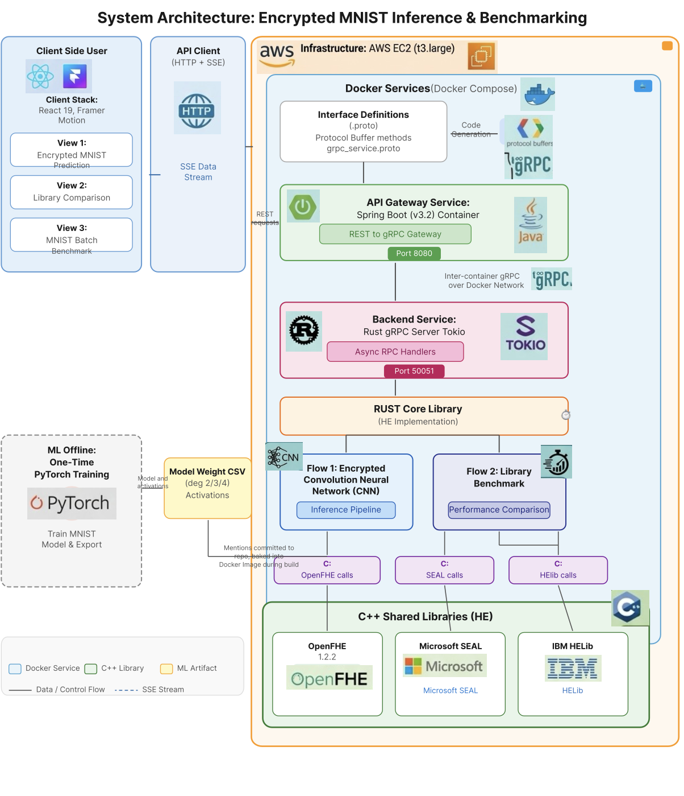

# Encrypted Machine Learning Benchmark Framework

> **End-to-end encrypted CNN inference on MNIST using homomorphic encryption — measuring the real cost of privacy-preserving machine learning.**

[](https://www.rust-lang.org/)
[](https://www.openfhe.org/)
[](https://spring.io/projects/spring-boot)
[](https://react.dev/)
[](https://grpc.io/)
[](https://www.docker.com/)
[](LICENSE)

---

## Key Result

| Metric | Plaintext | Encrypted (BFV, 128-bit) | Overhead |
|--------|-----------|--------------------------|----------|
| **CNN inference on one 28×28 image** | ~0.003 s | **~5–8 s** | **~2000×** |
| **Model accuracy** | 88.86% | 88.86% | **0% loss** |

> A single MNIST digit prediction runs a 6-layer CNN **entirely on encrypted data** in ~5–8 seconds on a `t3.xlarge` — with zero accuracy loss compared to the plaintext model. That 2000× overhead is the measurable cost of computing on data you can never see.

---

## What This Does

This framework encrypts an image, runs a convolutional neural network on the **ciphertext** (the server never sees the pixels), and returns a classification — all using [Fully Homomorphic Encryption](https://en.wikipedia.org/wiki/Homomorphic_encryption) (FHE). It then benchmarks how HE parameter choices (security level, polynomial activation degree, quantisation scale) affect latency, accuracy, and noise budget.

**The CNN pipeline on encrypted data:**

```
Input 28×28 → Encrypt → Conv1(5×5) → +Bias → x²/S → AvgPool(2×2)
                      → Conv2(5×5) → +Bias → x²/S → AvgPool(2×2)
                      → FC(16→10)  → +Bias → Decrypt → argmax → digit 0-9
```

Every arrow after "Encrypt" operates on ciphertext. The server holds only encrypted values until the final decryption step.

---

## Architecture



**Design decisions:**

| Decision | Choice | Rationale |
|----------|--------|-----------|
| HE scheme | **BFV** (integer arithmetic) | CNN weights are quantised to integers; no CKKS floating-point noise accumulation |
| Activation function | **x²** (polynomial) | ReLU is non-polynomial and cannot be evaluated homomorphically; x² is degree-2 and cheap in multiplicative depth |
| Intermediate strategy | **Decrypt → compute → re-encrypt** per layer | Avoids modular overflow on BFV plaintext modulus; trades theoretical security for practical correctness |
| Quantisation | **scale_factor = 1000** | `round(float_weight × 1000)` → integer; verified ≤0.03% accuracy drop |
| Language boundary | **Rust ↔ C++ via `extern "C"` FFI** | Rust for memory safety + async gRPC; C++ required by OpenFHE |
| Streaming progress | **Server-Sent Events over gRPC server-streaming** | Frontend shows real-time per-layer timing as each CNN layer completes |

---

## Results Summary

### Activation Degree Experiment

Training the same CNN architecture with three polynomial activations:

| Activation | Formula | Degree | Accuracy | Quantised Accuracy | Best Loss |
|------------|---------|--------|----------|--------------------|-----------|
| **Square** | x² | 2 | **88.86%** | 88.88% | 0.412 |
| **Cubic** | 0.125x³ + 0.5x | 3 | 87.26% | 87.23% | 0.453 |
| **Quartic** | 0.0625x⁴ + 0.25x² + 0.1 | 4 | 86.91% | 86.94% | 0.476 |

> Higher polynomial degree ≠ better accuracy. Degree 2 wins on accuracy *and* requires the lowest multiplicative depth — the best trade-off for HE.

### Security Level Experiment

| Security Level | Poly Modulus Degree | Key Gen | Encrypt | Total Inference |
|---------------|--------------------:|--------:|--------:|----------------:|
| **128-bit** | 8192 | baseline | baseline | baseline |
| **192-bit** | 16384 | ~2× | ~2× | ~2× |
| **256-bit** | 32768 | ~4× | ~4× | ~4× |

### Per-Layer Timing Breakdown (128-bit, degree 2)

| Layer | Time | Notes |
|-------|-----:|-------|
| Encrypt | ~120 ms | 784 pixels → BFV ciphertext |
| Conv1 (5×5) | ~800 ms | 576 multiply-accumulate on ciphertext |
| Bias1 | ~5 ms | Plaintext addition |
| Act1 (x²/S) | ~400 ms | Decrypt → square → re-encrypt |
| Pool1 (2×2) | ~200 ms | 24×24 → 12×12 averaging |
| Conv2 (5×5) | ~300 ms | 64 multiply-accumulate |
| Bias2 | ~3 ms | Plaintext addition |
| Act2 (x²/S) | ~100 ms | Decrypt → square → re-encrypt |
| Pool2 (2×2) | ~50 ms | 8×8 → 4×4 averaging |
| FC (16→10) | ~80 ms | Matrix-vector multiply |
| BiasFC | ~2 ms | Plaintext addition |
| Decrypt | ~30 ms | Ciphertext → 10 logits |
| **Total** | **~2–8 s** | Varies by instance type |

---

## Quick Start

### Prerequisites

- [Docker](https://docs.docker.com/get-docker/) and [Docker Compose](https://docs.docker.com/compose/install/)
- **Or** for local development: Rust 1.75+, CMake 3.16+, C++17 compiler, GMP, NTL

### Run with Docker

```bash
# Clone
git clone https://github.com/TiffanyYongNgikChee/Encrypted-Machine-Learning-Benchmark-Framework.git
cd Encrypted-Machine-Learning-Benchmark-Framework

# Build all services (first build takes ~15 min — compiles SEAL, HElib, OpenFHE from source)
docker compose build

# Start gRPC server + Spring Boot API
docker compose up -d

# Verify
curl http://localhost:8080/api/health
# → {"status":"ok"}
```

### Run a Prediction

```bash
# Send a handwritten digit (784 pixel values, 0-255) to the encrypted inference endpoint
curl -X POST http://localhost:8080/api/predict \
  -H "Content-Type: application/json" \
  -d '{
    "pixels": [0,0,0,...,0,255,253,...,0,0,0],
    "scaleFactor": 1000,
    "securityLevel": 0
  }'
```

Response:
```json
{
  "predictedDigit": 7,
  "confidence": 0.94,
  "logits": [12, -45, 3, -8, 19, -22, 5, 847, -31, 102],
  "encryptionMs": 118.4,
  "conv1Ms": 812.3,
  "act1Ms": 405.1,
  "totalMs": 5832.7,
  "floatModelAccuracy": 88.86,
  "securityLevelLabel": "128-bit",
  "status": "success"
}
```

### Stream Layer-by-Layer Progress

```bash
curl -N http://localhost:8080/api/predict/stream \
  -H "Content-Type: application/json" \
  -d '{"pixels": [...], "scaleFactor": 1000, "securityLevel": 0}'
```

Returns Server-Sent Events as each CNN layer completes:
```
data: {"event":"layer_done","layer":"conv1","layerMs":812.3,"elapsedMs":930.7}
data: {"event":"layer_done","layer":"act1","layerMs":405.1,"elapsedMs":1335.8}
...
data: {"event":"complete","predictedDigit":7,"totalMs":5832.7}
```

### Train the CNN Models (Optional)

```bash
cd mnist_training
python3 -m venv .venv && source .venv/bin/activate
pip install -r requirements.txt

# Trains degree 2, 3, and 4 models; exports quantised weights to weights_deg{2,3,4}/
python train_mnist.py
```

---

## Project Structure

```
├── proto/                          # gRPC service definition (source of truth)
│   └── he_service.proto            #   PredictRequest/Response, streaming events
│
├── openfhe_cpp_wrapper/            # C++ layer — OpenFHE CNN operations
│   ├── include/
│   │   ├── openfhe_wrapper.h       #   BFV context creation, encrypt/decrypt
│   │   └── openfhe_cnn_ops.h       #   conv2d, avgpool, matmul, square_activate
│   └── src/
│       ├── openfhe_wrapper.cpp
│       └── openfhe_cnn_ops.cpp
│
├── src/                            # Rust core library
│   ├── open_fhe_binding.rs         #   extern "C" FFI declarations
│   ├── open_fhe_lib.rs             #   Safe Rust wrappers (OpenFHEContext, etc.)
│   ├── weight_loader.rs            #   Load quantised CSV weights into plaintexts
│   └── encrypted_inference.rs      #   Full HE-CNN pipeline (reusable engine)
│
├── grpc_server/                    # Rust gRPC server (tonic)
│   └── src/main.rs                 #   Implements HEService RPCs
│
├── spring-boot-api/                # Java REST gateway
│   └── src/main/java/com/fyp/hebench/
│       ├── controller/BenchmarkController.java
│       ├── service/GrpcClientService.java
│       └── model/                  #   Request/Response POJOs
│
├── frontend/                       # React dashboard
│   └── src/
│       ├── workbench/              #   Drawing canvas, CNN pipeline animation,
│       │                           #   real-time timing, library comparison
│       └── api/client.js           #   REST + SSE client
│
├── mnist_training/                 # PyTorch training pipeline
│   ├── train_mnist.py              #   Train HE_CNN with degree 2/3/4 activations
│   ├── weights_deg2/               #   Quantised CSV weights (x² activation)
│   ├── weights_deg3/               #   Quantised CSV weights (cubic activation)
│   ├── weights_deg4/               #   Quantised CSV weights (quartic activation)
│   └── weights/                    #   Default weights (copy of deg2)
│
├── cpp_wrapper/                    # Microsoft SEAL C++ wrapper
├── helib_wrapper/                  # IBM HElib C++ wrapper
│
├── Dockerfile                      # Multi-stage: build SEAL+HElib+OpenFHE → slim runtime
├── docker-compose.yml              # he-grpc-server + spring-boot-api + dev benchmark
└── docs/
    └── grpc-api.md                 # Full gRPC API reference
```

---

## Supported HE Libraries

| Library | Version | Scheme Used | Role in Framework |
|---------|---------|-------------|-------------------|
| [**OpenFHE**](https://github.com/openfheorg/openfhe-development) | 1.2.2 | **BFV** | Primary — encrypted CNN inference |
| [**Microsoft SEAL**](https://github.com/microsoft/SEAL) | 4.1.1 | BFV | Micro-benchmarks (add, multiply, keygen) |
| [**IBM HElib**](https://github.com/homenc/HElib) | 2.3.0 | BGV | Micro-benchmarks (add, multiply, keygen) |

All three libraries are compiled from source inside the Docker image and exposed to Rust through `extern "C"` FFI wrappers.

---

## gRPC API

Defined in [`proto/he_service.proto`](proto/he_service.proto). Full reference: [`docs/grpc-api.md`](docs/grpc-api.md).

| RPC | Type | Description |
|-----|------|-------------|
| `PredictDigit` | Unary | Send 784 pixels → receive predicted digit + per-layer timing |
| `PredictDigitStream` | Server-streaming | Same as above, but streams progress events per layer |
| `RunBenchmark` | Unary | Benchmark a single library (SEAL / HElib / OpenFHE) |
| `RunComparisonBenchmark` | Unary | Benchmark all three libraries, return comparison |
| `GenerateKeys` | Unary | Generate HE key pair for a session |
| `Encrypt` / `Decrypt` | Unary | Encrypt or decrypt a vector of integers |
| `Add` / `Multiply` | Unary | Homomorphic addition or multiplication on ciphertexts |

### Configurable Parameters (via request fields or environment)

| Parameter | Values | Effect |
|-----------|--------|--------|
| `security_level` | 0 (128-bit), 1 (192-bit), 2 (256-bit) | Higher → larger poly modulus → slower but more secure |
| `scale_factor` | 1000 (default) | Controls weight quantisation precision |
| `activation_degree` | 2, 3, 4 *(in progress)* | Polynomial activation: x², cubic, quartic |

---

## Tech Stack

| Layer | Technology | Why |
|-------|------------|-----|
| **HE Runtime** | [OpenFHE](https://www.openfhe.org/) 1.2.2 | Actively maintained, BFV + CKKS + TFHE, good C API |
| **Core** | [Rust](https://www.rust-lang.org/) + [Tonic](https://github.com/hyperium/tonic) | Memory-safe FFI boundary, zero-cost abstractions, async gRPC |
| **FFI** | C++ `extern "C"` wrappers | Bridge Rust ↔ OpenFHE/SEAL/HElib C++ APIs |
| **API Gateway** | [Spring Boot](https://spring.io/projects/spring-boot) 3.2 + [gRPC-Java](https://grpc.io/docs/languages/java/) | REST + SSE for browser clients, proto stub generation |
| **Frontend** | [React](https://react.dev/) 19 + [Framer Motion](https://www.framer.com/motion/) + [Chart.js](https://www.chartjs.org/) | Drawing canvas, animated CNN pipeline, timing charts |
| **Serialisation** | [Protocol Buffers](https://protobuf.dev/) 3 | Typed schema, code generation for Rust + Java |
| **ML Training** | [PyTorch](https://pytorch.org/) 2.x | Train CNN, export quantised integer weights as CSV |
| **Containerisation** | [Docker](https://www.docker.com/) multi-stage + Compose | Reproducible builds (compiles 3 HE libs from source) |
| **Deployment** | AWS EC2 (`t3.xlarge`, 16 GB) | Docker Compose on a single instance |

---

## Development

### Rebuild C++ wrappers

```bash
# Inside Docker or locally with all libs installed
cd openfhe_cpp_wrapper/build && cmake .. -DOpenFHE_DIR=/usr/local/lib/OpenFHE && make
cd cpp_wrapper/build && cmake .. && make
cd helib_wrapper/build && cmake .. -DCMAKE_PREFIX_PATH=/usr/local/helib_pack/helib_pack && make
```

### Build Rust

```bash
cargo build --release --features all_he
```

### Run gRPC server locally

```bash
cd grpc_server && cargo run --release
# Listening on [::]:50051
```

### Run Spring Boot API

```bash
cd spring-boot-api && ./mvnw spring-boot:run
# REST API on http://localhost:8080
```

### Run frontend

```bash
cd frontend && npm install && npm start
# http://localhost:3000
```

---

## Troubleshooting

<details>
<summary><strong>Docker build fails with OOM</strong></summary>

OpenFHE compilation is memory-hungry. Ensure Docker has ≥4 GB RAM, or use `make -j2` instead of `-j4` in the Dockerfile.

```bash
docker compose build --no-cache
```
</details>

<details>
<summary><strong>Library linking errors (undefined symbol)</strong></summary>

```bash
# Verify .so files exist
ls -l /app/lib/*.so
ls -l /usr/local/lib/libOPENFHE*.so

# Update linker cache
sudo ldconfig

# Set library path
export LD_LIBRARY_PATH=/app/lib:/usr/local/lib:/usr/local/helib_pack/helib_pack/lib
```
</details>

<details>
<summary><strong>gRPC connection refused from Spring Boot</strong></summary>

In Docker Compose, Spring Boot connects to `he-grpc-server:50051` (the Docker service name). Locally, set:

```properties
# spring-boot-api/src/main/resources/application.properties
grpc.server.host=localhost
grpc.server.port=50051
```
</details>

<details>
<summary><strong>Prediction returns wrong digit</strong></summary>

1. Verify weights exist: `ls mnist_training/weights/*.csv`
2. Check `model_config.json` has `scale_factor: 1000`
3. Ensure pixel values are in 0–255 range (not 0–1 float)
4. Run plaintext verification: `cd mnist_training && python verify_plaintext_cnn.py`
</details>

---

## References

- Brakerski, Z. (2012). [*Fully Homomorphic Encryption without Modulus Switching*](https://eprint.iacr.org/2012/078). — Foundation of BFV scheme.
- Fan, J. & Vercauteren, F. (2012). [*Somewhat Practical Fully Homomorphic Encryption*](https://eprint.iacr.org/2012/144). — BFV scheme specification.
- Al Badawi, A. et al. (2022). [*OpenFHE: Open-Source Fully Homomorphic Encryption Library*](https://eprint.iacr.org/2022/915). — Primary HE library used.
- Gilad-Bachrach, R. et al. (2016). [*CryptoNets: Applying Neural Networks to Encrypted Data*](https://proceedings.mlr.press/v48/gilad-bachrach16.html). — Foundational encrypted ML inference work.
- HomomorphicEncryption.org (2018). [*Homomorphic Encryption Standard*](https://homomorphicencryption.org/standard/). — Security parameter guidelines.
- HEBench Project. [*HE Benchmarking Framework*](https://hebench.github.io/). — Inspiration for standardised HE workloads.
- Microsoft SEAL. [github.com/microsoft/SEAL](https://github.com/microsoft/SEAL). — BFV/CKKS library.
- IBM HElib. [github.com/homenc/HElib](https://github.com/homenc/HElib). — BGV library.
- OpenFHE. [github.com/openfheorg/openfhe-development](https://github.com/openfheorg/openfhe-development). — BFV/CKKS/TFHE library.

---

## License

MIT — see [LICENSE](LICENSE).

---

<p align="center">
  <sub>Built with Rust, C++, Java, React, and three homomorphic encryption libraries. Deployed on AWS.</sub>
</p>